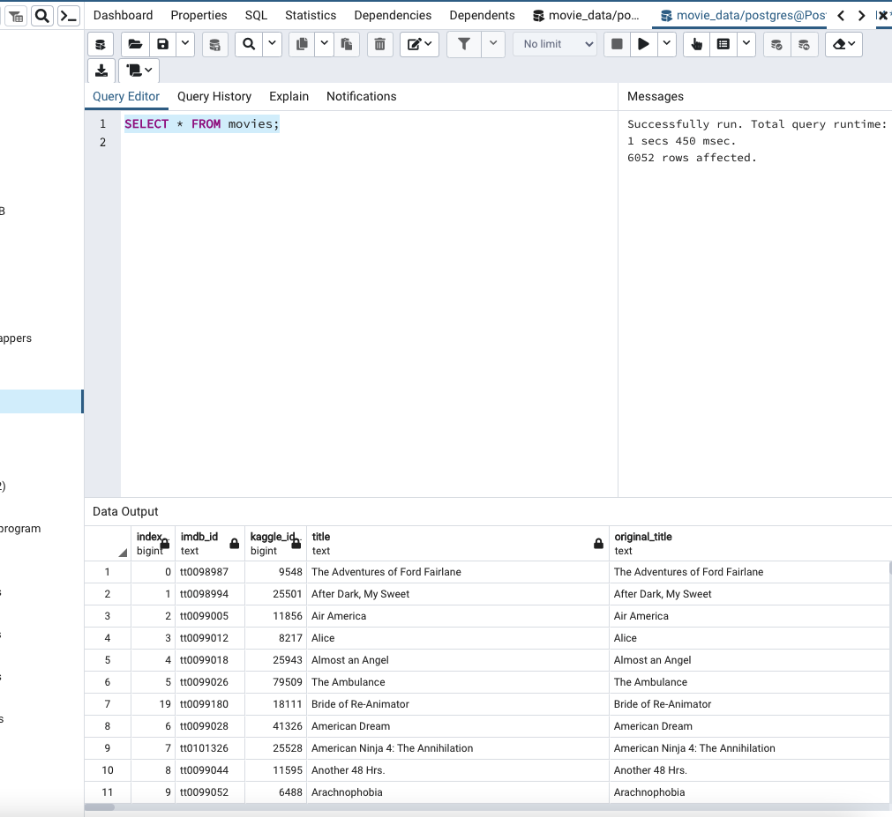
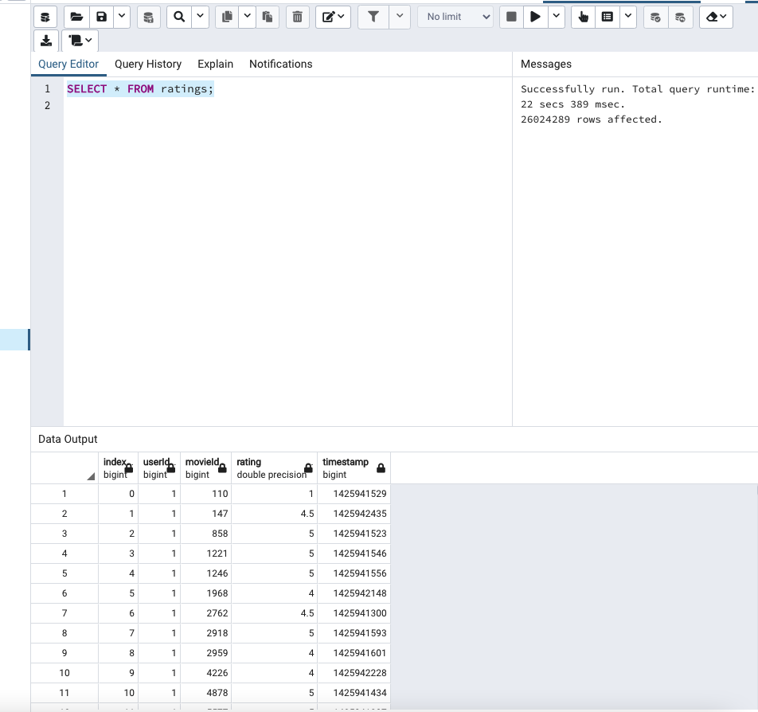

# Movies Ratings ETL

## Summary

The goal of this project is to extract, transform and load a data set of movie data and movie ratings rating collected from Wikipedia and Kaggle to be used to create a data set for evaluation of the success of movies.  To determine the success of the movies in the dataset the budget, critic ratings, and genre will be some of the criteria that will be used to evaluate the movies and see if trends can be identified. 

# Results

## Extract

Data from Wikipedia and Kaggle was parsed to create a list of movies with data such as budget, revenue, director, and genre to name a few.  Both datasets are not complete but provided a data set that included 45466 rows from Kaggle in a csv file and 7311 Wikipedia entries that were extracted as a json file.  The goal is to merge these files based on the iMDb_id which is unique to each movie and present in each dataset.  Additionally, a csv file containing critic data obtained from Kaggle was downloaded which will be the sources of the ratings data within our database.  The ratings data has a unique Kaggle id which can be connected to the movie data to allow the ratings to be linked to the movie data that was collected.

## Transform

For each dataset the information contained within the each contained various forms of data such as revenue and budget data.  The data types in each file were not in the ideal form for evaluation such as strings that represented integer values etc.  Additionally, the classification of data such as director was found in different column classification such as 'director' and 'directed by' or 'produced by' and 'producer'.  These columns needed to be consolidated into one form and the titles standardized for each dataset.  Additional editing to reduce columns representing alternative columns and other redundant data was used to reduce the Wikipedia json data from the initial 191 columns to a more manageable 21.  As the iMDB id was only available within a link contained within the json file for the Wikipedia data, a regex for the string containing the iMDB id was used to parse this data from the string and create a column containing this extracted string.  This was possible as the format of the iMDB id was standardized in a form that followed the structure 'tt1234567' where the digits were unique to the movie. This provide a unique identifier that could be used to merge the two data sets containing the movie data. After cleaning the data within rows with duplicate iMDB data was removed and rows with missing budget data were deleted.  

To clean and transform the Kaggle movie dataset required less manipulation as the date set was already standardized for the most part and just needed to remove data that was not needed for the analysis such as adult movies and movies that were not available on video.  The final changes done with this dataset was to change the data types for the budget, popularity, and release date to allow them to match the form in the other data set.

After the two datasets were transformed, they were merged on the iMDB_id columns to create a movie dataframe, movie_df, which contained the relevant movies data by dropping the title, release date, language and production company from the wiki data set and merging the Kaggle and Wikipedia datasets columns containing the runtime, budget and revenue data using a function created to fill gaps in the Kaggle dataset with information in the Wikipedia data set. The merged file was then filtered to get the desired columns and then the columns were renamed to their final form.

Finally, the ratings data was standardized for datetime and grouped by movie id to make them more efficient for handling the analysis.  The ratings data was pivoted and merged with the movie data set to provide a dataframe containing the movie and rating data.

## Load

The final step for the creation of the movie data set was to load the new dataframe files into a postgreSQL database to for further queries.  The movie_df and ratings.csv files were selected to be imported into the database.  This was complete using the to_sql module in Pandas to import the data into the database created in postgreSQL.  As the ratings data contained over 26 million entries, the data was imported in chunks of 1000000 to manage the memory requirements needed for the import and monitor the progress of the importing of the data. Upon the completion of this the dataframes were successfully loaded into the movie_data database and readably accessible using queries within postgreSQL. Below shows the successfully imported data into the database created for this project.

# Summary

The use of the ETL paradigm for data extraction, cleaning and loading provides a structured approach to managing datasets that are collected from various sources to be used in data analysis.  As there are a wide range of methods of data storage and the forms data can be collected and stored in, this approach gives a clear methodology to bring data together in a form that can be more easily manipulated and analysed to identify patterns and trends within complex data sets.
